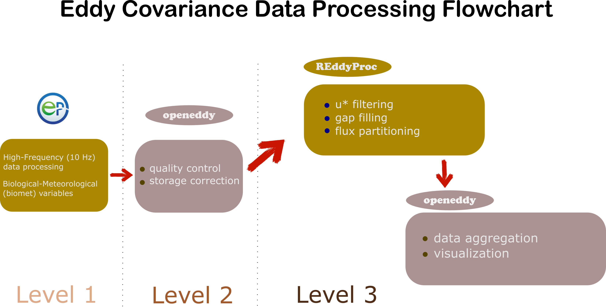

```{r setup, include=FALSE}
knitr::opts_chunk$set(echo = TRUE)
library(knitr)
library(kableExtra)
library(tidyverse)
library(openeddy)
library(REddyProc)
library(fs)

library(sf) # for ROI
library(leaflet)

```
<!--
# Eddy Covariance Flux Data processing Protocol at LTAR PRHPA
-->
## Overview

This eddy covariance (EC) flux data workflow demonstrates a streamlined data processing protocol for net ecosystem exchange of CO~2~ (NEE) and H~2~O (or evapotranspiration) flux from the [LTAR platte river/high plains aquifer (PRHPA)](https://ltar.ars.usda.gov/sites/prhpa/) site. The workflow is developed mainly based on two R packages, including [openeddy](https://github.com/lsigut/openeddy) and [REddyProc](https://github.com/EarthyScience/REddyProc). This workflow/protocol consists of a set of post-processing functions/steps for flux data quality control and quality assurance (QAQC).

some abbreviations commonly used in this document and across flux community:

* EC: Eddy Covariance
* QC: Quality Control
* QA: Quality Assurance
* SA: Sonic Anemometer
* (IR)GA: (Infra-red) Gas Analyzer
* Tau: Momentum Flux ($Kg~m^{-1}~s^{-2}$)
* H: Sensible heat flux ($W~m^{-2}$)
* LE: Latent heat flux ($W~m^{-2}$)
* NEE: Net ecosystem exchange ($\mu mol~m^{-2}~s{-1}$)
* u: Longitudinal wind speed component ($m~s^{-1}$)
* v: Across wind speed component  ($m~s^{-1}$)
* w: Vertical wind speed component ($m~s^{-1}$)
* ts: Sonic temperature ($^\circ C$)
* h2o: water vapor ($H_2O$) concentration ($mmol~mol^{-1}$)
* co2: $CO_2$ concentration ($\mu mol~mol^{-1}$) 

## Prerequisites

This post-processing workflow requires the following inputs: 

* [EddyPro](https://www.licor.com/products/eddy-covariance/eddypro) full [output files](https://www.licor.com/support/EddyPro/topics/output-files-full-output.html). Annual complete file for each individual year would be preferred and recommended, mostly due to the constraints by gap filling and flux partitioning functions in `REddyProc` package. Namely, data series with multiple years or fragments shorter than half a year are not well supported.

* Meteorological data (or biomet data), went through its independent workflow for unit conversion, QAQC, and gap-filling. 

The recommended meteorological variables include:

```{r biomet_vars, results='asis', echo = FALSE, warning=FALSE}
options(knitr.kable.NA = '')
knitr::opts_knit$set(bookdown.internal.label = TRUE)
table_data <- data.frame(
  Label = c("$GR$", "$T_{air}$", "PAR", "$R_n$", "$T_{soil}$", "$VPD$", "$RH$", "$P$"),
  Name = c(
    "global radiation",
    "air temperature at EC height",
    "photosynthetically active radiation",
    "net radiation",
    "soil temperature at soil surface",
    "vapor pressure deficit at EC height",
    "relative humidity at EC height",
    "precipitation"
  ),
  Unit = c(
    "$W~m^{-2}$",
    "$^\\circ$C",
    "$\\mu mol~m^{-2}~s^{-1}$",
    "$W~m^{-2}$",
    "$^\\circ$C",
    "$hPa$",
    "$\\%$",
    "$mm$"
  ),
  stringsAsFactors = FALSE
)

kable(
  table_data,
  escape = FALSE,
  #caption = "Table 1, meteorological variables",
  booktabs = TRUE) %>%
  kable_styling(full_width = FALSE, font_size = 12) |> 
  footnote(
    general = "Note: $GR$ and $T_{air}$ are required for minimum setup. Gaps in $GR$ are not allowed due to its use for day/night separation with despikeLF().",
   general_title = "",
    escape = FALSE
  )
```

Table \@ref(tab:biomet_vars)

Packages and software needed to be installed:

* Software and platform: R and R studio
* R packages, including `tidyverse`, `openeddy`, and `REddyProc`
* `fs` package: provides a cross-platform, uniform interface for file system operations in R.

## Custimizing the workflow
To revise and customize the code for your sites, you mainly need to edit the `ltar_unl_settings_2026-02-18.R` file accordingly.  

The setting edits include: (1) renaming meteorological variables to workflow standard (`Met_mapping` object) and (2) defining region of interest (ROI) `boundary`.

## The workflow



# Site setup

Consisting of LTAR-PRHPA Flux site:

* sonic anemometer: CSAT3A, Campbell
* open-path CO2/H2O IRGA:EC150 from Campbell before March 2020, and LI-7500DS afterwards
* Data synchronization and data logger: EC 100 and CR5000, Campbell
* Soil heat flux plate, HFP01, 6 cm in depth
* soil water sensor: CS616, 6 cm and 25 cm in depth

# Quality Assurance and Quality Control
Quality assurance (QA) and quality control (QC) are distinct for quality management of EC flux data. As proactive measure and process-oriented, QA is to prevent data loss or bad data by establishing routine maintenance procedures. For example, we need to routinely (remote and in situ) check the site, inspect and calibrate instruments (especially gas analyzers), and repair the faulty ones in time. Thoughtful and well maintenance of the site are critical, such as cleaning the dust, preventive procedure for damages by weather and animals, and timely replacing batteries and desiccant bags. An example for best practices checklist is available from [Ameriflux.]( https://ameriflux.lbl.gov/wp-content/uploads/2023/08/Best_practices_checklist-2023-08-11.pdf) On the other hand, QC is reactive and product (flux data)-oriented, namely focusing on detecting and correcting defects in the flux data through testing and inspection, such as flagging.

QC procedure for EC flux data consist of two phrases:

1. obtaining QC flags from EddyPro output. The common flagging scheme is:

    + flag 0 – high quality
    + flag 1 – minor issues
    + flag 2 – major issues
2. application of QC filtering (either removing or propagating according to the QC flags). Selection of best efficient flags are site-dependent and task-specific, considering trade-off between deleting spurious data and minimizing gaps and keeping high data availability. The common practice is to keep flag 0 and flag 1 data, and to discard flag 2 (low data quality) ones. 

## ROI boundary
The boundary of the study site delineates spatial extent of the studied ecosystem, or the region of interest (ROI). The edge of the studied ecosystem is critical for footprint analysis, namely to inspect whether the ROI is within or beyond the flux fetch (footprint) along the wind direction.

```{r results='asis', echo = FALSE, warning=FALSE}
### Load packages and data =====================================================

# Example for LTAR-PRHPA pasture site
tower <- c(-96.461542, 41.144725) # c(longtitude, latitude)


# Fetch boundary defined by the user as a vector of distances [m] from tower
# - test e.g.: boundary <- c(150, 300)
boundary <- 
  round(c(168.780731106454,
    169.183194638855,
    170.882336040685,
    173.944967030343,
    178.495573098197,
    184.729065084478,
    192.932314955919,
    203.519207356786,
    217.087918319131,
    234.516916401058,
    220.451788128581,
    205.839787735011,
    194.429277578204,
    185.555786643288,
    178.761129490315,
    173.727376795414,
    170.236665944739,
    168.146462911406,
    167.37466236847,
    167.891480045134,
    169.71659855896,
    172.921046352203,
    177.634150686771,
    184.056869352615,
    192.484178088854,
    203.341474578383,
    214.555577013468,
    196.159384775566,
    181.952887607214,
    170.88304661899,
    162.248908651932,
    155.571616180284,
    150.51938165785,
    146.862503046101,
    144.445770895976,
    143.171547589434,
    142.98986219874,
    143.893568318863,
    145.917665980502,
    148.953103981661,
    153.293220027326,
    159.135823852179,
    166.757566095119,
    176.557016805629,
    189.366325090942,
    205.964016004746,
    227.664567120047,
    225.55200919967,
    213.119890064622,
    203.453470857287,
    196.055752325788,
    190.581875747358,
    186.795711409634,
    184.543137619479,
    183.735972035383,
    184.349522672954,
    186.440136890606,
    190.051670714264,
    195.330560062419,
    202.503101338246,
    211.900817221016,
    224.001686995719,
    239.497692905488,
    240.717576656129,
    221.939125056055,
    207.350046651755,
    195.963962894719,
    187.113752982361,
    180.339355254585,
    175.321497250216,
    171.841364205673,
    169.659295400534), 2)

# The Universal Transverse Mercator (UTM) zone of the location
UTM_zone <- 14  #https://hub.arcgis.com/datasets/esri::world-utm-grid/

# Choose the angle that resolves the edge of each circular sector
# - the lower the plot_res, the higher the smoothness
# - plot_res takes care only of the smoothness of the curvature on the edge of a 
#   single angular sector segment. Thus it only matters if angular resolution of 
#   the boundary (orig_res) is low (e.g. if boundary = c(150, 300), orig_res = 
#   180)
# - plot_res = 1 should be sufficient for most cases
plot_res <- 1 

### Create spatial polygon based on supplied fetch boundary ====================

# Angular resolution of the original fetch distances
orig_res <- 360 / length(boundary)

# Warn user if only one point per circular sector should be produced 
if (plot_res > orig_res) 
  warning('plot_res larger than orig_res - reduce plot_res')

# Reconstruct the azimuths (assumes first one is North)
azimuths <- seq(0, 360 - orig_res, by = orig_res)

# Half of original resolution
hr <- orig_res / 2

# Compute plotting angles for each azimuth and combine them to vector
ang_l <- lapply(azimuths, 
                function(x) seq(-hr + x, hr + x, by = plot_res))
ang <- do.call(c, ang_l) 

# Specify corresponding fetch distances to each angle
distance <- rep(boundary, each = length(ang_l[[1]]))

# Convert tower location to spatial type with coordinate reference system (CRS)
tower_sfc <- st_sfc(st_point(tower), crs = "+proj=longlat +datum=WGS84") 

# Transform the projection to UTM
tower_UTM <- st_transform(tower_sfc, 
                          paste0("+proj=utm +zone=", UTM_zone, " ellps=WGS84"))
  
# Function to get XY coordinates based on distance from reference point
get_point <- function(coord, distance, angle) {
  X <- distance*cos(pi/2-angle/180*pi)+coord[1]
  Y <- distance*sin(pi/2-angle/180*pi)+coord[2]
  c(X, Y)
}

# Find location of each edge point and save it to list
# - get_point() is not vectorized
polygon_l <- vector("list", length(ang))
for (i in seq_along(ang)) {
  polygon_l[[i]] <- get_point(st_coordinates(tower_UTM), distance[i], ang[i])
}

# Create a matrix from the edge points
polygon_m <- do.call(rbind, polygon_l)

# Create polygon spatial type from edge points and assign CRS
# - to close the polygon, first coordinate must be repeated
polygon <- st_sfc(st_polygon(list(rbind(polygon_m, polygon_m[1, ]))),
                  crs = paste0("+proj=utm +zone=", UTM_zone, " ellps=WGS84"))

# Transform the projection to WGS84
polygon_coords <- 
  st_transform(polygon, crs = "+proj=longlat +datum=WGS84") |> 
  # Convert polygon to a format leaflet understands
  st_coordinates()

####
leaflet() |>
  addProviderTiles(providers$Esri.WorldImagery) |>  # satellite tiles, free
  addPolygons(
    lng = polygon_coords[, 1],
    lat = polygon_coords[, 2],
    color = "red",
    fillOpacity = 0.3,
    weight = 2
  ) |>
  addMarkers(
    lng = tower[1],
    lat = tower[2],
    popup = "Tower"
  )
# EOF
```


## Naming strategy with the EC workflow

### [EddyPro full output variable names (simplified)](https://www.licor.com/support/EddyPro/topics/output-files-full-output.html) 
```{r, results='asis', echo=FALSE, warning=FALSE}
library(knitr)
library(kableExtra)

table_data <- data.frame(
  Label = c(
    "filename","date","time","file_records","used_records",
    "Tau","qc_Tau","rand_err_Tau","H","qc_H","rand_err_H",
    "LE","qc_LE","rand_err_LE","gas_flux","qc_gas_flux",
    "rand_err_gas_flux","H_strg","LE_strg","gas_strg",
    "gas_v-adv","gas_molar_density","gas_mole_fraction",
    "gas_mixing_ratio",#"gas_time_lag","gas_def_timelag",
    # "sonic_temperature",
    "air_temperature","air_pressure",
    "air_density","air_heat_capacity","air_molar_volume",
    "ET",#"water_vapor_density","e","es","specific_humidity",
    "RH","VPD","Tdew",#"u_unrot","v_unrot","w_unrot",
    "u_rot","v_rot","w_rot","wind_speed",#"max_wind_speed",
    "wind_dir",#"yaw","pitch",
    "u_star","TKE","L","*zeta*",
    "bowen_ratio","T_star","footprint_model","x_offset",
    "x_peak",#"x_10%","x_30%","x_50%",
    "x_70%","x_90%",
    #"un_Tau",
    "Tau_scf",#"un_H",
    "H_scf",#"un_LE",
    "LE_scf",
    #"un_gas_flux","gas_scf",
    #"spikes",#"amp_res","drop_out",
    #"abs_lim","skw_kur","discontinuities","time_lag",
    #"attack_angle","non_steady_wind",
    "var_spikes",
    "AGC",
    "RSSI","var_var","w_var_cov","extravar_mean"
  ),
  Units = c(
    " ","yyyy-mm-dd","HH:MM"," "," ",
    "$kg~m^{-1}~s^{-2}$"," ","$kg~m^{-1}~s^{-2}$","$W~m^{-2}$"," ","$W~m^{-2}$",
    "$W~m^{-2}$"," ","$W~m^{-2}$","$µmol~m^{-2}~s^{-1}$ (†)"," ",
    "$µmol~m^{-2}~s^{-1}$ (†)","$W~m^{-2}$","$W~m^{-2}$","$µmol~m^{-2}~s^{-1}$ (†)",
    "$µmol~m^{-2}~s^{-1}$ (†)","$mmol~m^{-3}$","$µmol~m^{-2}~s^{-1}$ (†)",
    "$µmol~m^{-2}~s^{-1}$ (†)",#"s","T/F", "K",
    "K","Pa",
    "$kg~m^{-3}$","$J~K^{-1}~kg^{-1}$","$m^3~mol^{-1}$",
    "$mm~hour^{-1}$",#"kg m-3","Pa","Pa","kg kg-1",
    "%","Pa","K",#"m s-1","m s-1","m s-1",
    "$m~s^{-1}$","$m~s^{-1}$","$m~s^{-1}$","$m~s^{-1}$",#"m s-1",
    "°",#"°","°",
    "$m~s^{-1}$","$m^2~s^{-2}$","$m$"," ",
    " ","K"," ","$m$",
    "$m$",#"m",#"m","m",
    "$m$", "$m$",
    #"kg m-1 s-2"," ","W m-2"," ","W m-2"," ",
    #"µmol m-2 s-1 (†)"," "," "," "," ",
    " "," "," ",#" ",
    #"0/1/9","0/1/9",
    " ",
    " ",
    " ","(‡)","(‡)","(‡)"
  ),
  Description = c(
    "Name of the raw file (or the first of a set) ",
    "Date of the end of the averaging period",
    "Time of the end of the averaging period",
    "Number of valid records in raw file(s)",
    "Number of valid records",
    "Corrected momentum flux",
    "Quality flag for momentum flux",
    "Random error for momentum flux, if selected",
    "Corrected sensible heat flux",
    "Quality flag for sensible heat",
    "Random error for sensible heat, if selected",
    "Corrected latent heat flux",
    "Quality flag latent heat",
    "Random error for latent heat, if selected",
    "Corrected gas flux",
    "Quality flag for gas flux",
    "Random error for gas flux",
    "Storage sensible heat flux",
    "Storage latent heat flux",
    "Storage gas flux",
    "Vertical advection flux",
    "Gas molar density",
    "Gas mole fraction",
    "Gas mixing ratio",
    #"Time lag used to synchronize gas time series",
    #"Flag: default (T) or calculated (F) time lag",
    #"Mean temperature of ambient air from anemometer",
    "Mean temperature of ambient air",
    "Air pressure",
    "Air density",
    "Specific heat capacity",
    "Molar volume",
    "Evapotranspiration",
    #"Water vapor mass density",
    #"Vapor partial pressure",
    #"vapor partial pressure at saturation ",
    #"Specific humidity",
    "Relative humidity",
    "Vapor pressure deficit",
    "Dew point temperature",
    #"Unrotated wind u",
    #"Unrotated wind v",
    #"Unrotated wind w",
    "Rotated wind u (mean wind speed)",
    "Rotated wind v (should be 0)",
    "Rotated wind w (should be 0)",
    "Mean wind speed",
    #"Max instantaneous wind speed",
    "Wind direction (from)",
    #"Yaw angle",
    #"Pitch angle",
    "Friction velocity",
    "Turbulent kinetic energy",
    "Monin-Obukhov length",
    "Stability parameter, (z-d)/L",
    "Bowen ratio (H/LE)",
    "Scaling temperature",
    "Footprint model",
    "Footprint offset",
    "Footprint peak",
    #"Footprint 10%",
    #"Footprint 30%",
    #"Footprint 50%",
    "Footprint 70%",
    "Footprint 90%",
    #"Uncorrected Tau",
    "Spectral correction factor for $~Tau$",
    #"Uncorrected H",
    "Spectral correction factor for $~H$",
    #"Uncorrected LE",
    "Spectral correction factor for $~LE$",
    #"Uncorrected gas flux",
    #"Gas spectral correction",
    #"Spike flags",
    #"Amplitude resolution flags",
    #"Drop-out flags",
    #"Absolute limit flags",
    #"Skewness/kurtosis flags",
    #"Discontinuity flags",
   # "Time lag flags",
    #"Attack angle flag",
    #"Non-steady wind flag",
    "Spike numbers detected and eliminated",
    "AGC value",
    "RSSI value",
    "Variance",
    "Covariance",
    "Extra variable mean"
  )
)

kable(table_data,
      caption = "Table 2. Shorthand for variables in output files from EddyPro",
      booktabs = TRUE) %>%
   kable_styling(full_width = FALSE) %>%
  row_spec(seq(1, nrow(table_data), 2), background = "#F2F2F2") %>%  # shade every other row
  footnote(
    general = c(
      "\n † Concentrations and fluxes for water vapor are provided as $mmol~mol^{-1}$ and $mmol~m^{-2}~s~^{-1}$, respectively.\n",
      "‡ Units depend on the nature of the variable."
    ),
    threeparttable = FALSE,
    footnote_as_chunk = TRUE
  )
```

### Meteorological variables
the variables are listed in the Prerequisites in Table \@ref(tab:meteorology_table)

### Naming strategy for column names:
#### QC prefixes specify which flux is affected:

* qc_Tau_, qc_H, qc_LE, qc_NEE: only applicable for the respective fluxes.
* qc_SA_: applicable to fluxes replying only on sonic anemometer-SA (Tau & H).
* qc_GA_: applicable to fluxes relying on gas analyzer-GA (LE & NEE), where only GA issues are considered.
* qc_SAGA_:applicable to fluxes relying on both SA and GA (LE & NEE), where both SA and GA issues are considered.
* qc_ALL_:applicable to all fluxes (often not applied to Tau)

#### QC suffixes specify which [QC test/filter](https://www.licor.com/support/EddyPro/topics/despiking-raw-statistical-screening.html) was applied to get the QC flags:

* _SSITC: steady state and integral turbulence characteristics. A typical QC output from EddyPro. Renamed from original qc_Tau, qc_H, qc_LE, and qc_co2_flux via `correct()` in `WF_1_data_preparation`.
* _spikesHF for **despiking**: detecting and eliminating short-term outranged values.
* _ampres for **amplitude**: amplitude resolution of the recorded data to capture the flucuation, and to detect the "step ladder appearance" in the time series.
* _dropout for **drop-outs**: identifying short periods of "flat valley" in the data series, a sign of short-term instrument malfunction. Extreme bins should have less consecutive data points. 
* _abslim for **absolute limits**: values outside a user-defined plausible range, such as water concentration above 0.  
* _skewkurt_sf, _skewkurt_hf, and _skewkurt for **skewness and Kurtosis**: detect periods of instrument malfunction. Skewness measures the asymmetry of probability distribution, while kurtosis measures the deviation from normal distribution (peaked or flat).
* _discont_sf, _discont_hf, and _discont for **discontinuities**: detect discontinuities that lead to semi-permanent changes. 
* _timelag_sf, _timelag_hf, and _timelag for **time Lags** : time lags determined by covariance maximization are too different from "user-suggested time lags". Namely, the fluxes miatched for exppected time lags and "actual" time lags. 
* _attangle for **angle of attack**: calculate sample-wise angle of attacks.
* _nonsteady for **steadiness of horizontal wind**: test whether along-wind and crosswind components undergo a systematic change (increase or decrease) throughout the file. Flags the instationary horizontal wind.
* _missfrac: missing data in averaging period
* _scf: spectral correction factor
* _wresid: mean unrotated w (double rotation) or w residual (planar fit)
* _runs: runs with repeating values.
* _lowcov: fluxes too close to 0 (issues during covariance computation)
* _var: variances
* _LI7200: CO2 and H2O signal strength 
* _interdep: flux interdependency
* _man: manual quality control
* _spikesLF: outliers in low frequency data
* _fetch70: check of x_70 against fetch distance for give wind direction
* _forGF:composite QC column to screen fluxesfor gap-filling 

More details are available via `extract_QC()`.

#### Naming strategy for `REddyProc`
Details are available at the [REddyProcWeb website](https://bgc.iwww.mpg.de/5624884/Data-Formats)

The input format is:
```{r results='asis', echo=FALSE, warning=FALSE}
# sample data
df <- data.frame(
  Year = c(1998, 1998, 1998, 1998),
  DoY = c(1, 1, 1, 1),
  Hour = c(0.5, 1, 1.5, 2),
  NEE = c(-1.21, 1.72, -9999, -9999),
  LE = c(1.49, 3.8, 1.52, 3.94),
  H = c(-11.77, -13.5, -18.3, -17.47),
  Rg = c(0, 0, 0, 0),
  Tair = c(7.4, 7.5, 7.1, 6.6),
  Tsoil = c(4.19, 4.2, 4.22, 4.23),
  rH = c(55.27, 55.95, 57.75, 60.2),
  VPD = c(4.6, 4.6, 4.3, 3.9),
  Ustar = c(0.72, 0.52, 0.22, 0.2)
)

# Create the table
kable(df, 
      # format  = "latex",
      booktabs = TRUE,
      caption = "Eddy covariance flux measurements at half-hourly resolution.",
      label = "tab:flux_data",
      digits = 2,
      col.names = NULL,
      align = "c") %>%
  kable_styling(latex_options = c("striped", "hold_position"),
                font_size = 9) |> 
    # Second header row (below): Units
  add_header_above(c("---" = 1, "---" = 1, "---" = 1,
                     "umol m-2 s-1" = 1, "W m-2" = 1, "W m-2" = 1, "W m-2" = 1,
                     "°C" = 1, "°C" = 1, "%" = 1, "hPa" = 1, "m s-1" = 1), 
                   line = FALSE) |> 
  # First header row (top): Variable names
  add_header_above(c("Year " = 1, " DoY" = 1, "Hour" = 1,
                     "NEE" = 1, "LE" = 1, "H" = 1, "Rg" = 1,
                     "Tair" = 1, "Tsoil" = 1, "rH" = 1, "VPD" = 1, "Ustar" = 1)) |> 
  # Add top line (before header)
  row_spec(0, extra_latex_after = "\\toprule") |>
  # Add bottom line (after last row of data)
  row_spec(nrow(df), extra_latex_after = "\\bottomrule")
```
The format is critical. Requirements are:

* Tab-delimited or space-delimited ASCII file (Excel, save as TAB delimited text)
* The first row contains variable names, including `Year` (xxxx), `DoY` (day of the year, from 1 to 365 or 366), and `Hour` (from 0.5 to 24.0) in local time **without** daylight savings time. Flux measurement variables are `NEE` (net ecosystem exchange), `LE` (latent heat), and `H` (Sensible heat). Meteorological variables are `Rg`(shortwave incoming flobal radiation), `VPD`(vapor pressure deficit), `rH` (relative humidity), `Tair`(air temperature), `Tsoil` (soil temperature), and `Ustar` (friction velocity). 
* The second row contains the unit, such as `umolm-2s-1` or `ms-1`, and use `-` for filler if not applicable.
* Optional user-specified `season` column: Seasons represent similar micro-meteorological conditions, especially surface roughness under management in agriculture landscape. The season season for farmland is recommened for `u*` filtering. But for grazing pasture, it is not critical.
* Three months of data records is minimal requirement.
* `Hour` indicates the **end** of each half-hour period. 48 rows must required for each day, and first must be 0.5, and last must be 24.0. 
* Low quality or invalid values should not be used, should be set to `-9999` beforehand.
* `VPD` is used for gap-filling, and if unavailable, can be calculated from `rH` and `Tair`.

The output format are listed as below. 
```{r  results='asis', echo=FALSE, warning=FALSE}

gap_fill <- data.frame(
  Suffix = c(
    "_Thres", "_orig", "_f", "_fqc", "_fall", "_fall_qc",
    "_fnum", "_fsd", "_fsdu", "_fsdug", "_fmeth", "_fwin"
  ),
  Description = c(
    "Threshold of uStar values used to mark insufficient conditions",
    "Original values used for gap filling",
    "Original values and gaps filled with mean of selected datapoints (condition depending on gap filling method)",
    "Quality flag: 0 = original, 1 = most reliable, 2 = medium, 3 = least reliable",
    "All values considered as gaps (for uncertainty estimates)",
    "All values considered as gaps (for uncertainty estimates)",
    "Number of datapoints used for gap filling",
    "Standard deviation of datapoints used for gap filling (uncertainty)",
    "Standard deviation across uStar thresholds (uncertainty, bias)",
    "Combination of random uncertainty and uncertainty due to u*: sqrt(fsd$^2$ + fsdu$^2$)",
    "Method used for gap filling:
    
     1 = similar meteo condition (sFillLUT with Rg, VPD, Tair)
     2 = similar meteo (sFillLUT with Rg only)
     3 = mean diurnal course (sFillMDC))",
    "Full window length used for gap filling"
  )
)

kable(gap_fill,
      booktabs = TRUE,
      escape = FALSE,
      caption = "Description of gap filling output variables.",
      col.names = c("Suffix", "Description"),
      align = c("l", "l")) %>%
  kable_styling(
    bootstrap_options = c("striped", "hover"),
    font_size = 12,
     full_width = FALSE) |> 
  column_spec(1, width = "2.5cm", monospace = TRUE) %>%
  column_spec(2, width = "14cm") %>%
  row_spec(nrow(gap_fill), extra_latex_after = "\\bottomrule")
```

When bootstrapping was performed, several output columns are re-estimated with gap-Filling based on low, median, and high estimates of the uStar-Threshold.

```{r results='asis', echo=FALSE, warning=FALSE}
ustar_boot <- data.frame(
  Suffix = c("_uStar", "_U05", "_U50", "_U95"),
  Description = c(
    "Estimate on the original unbootstrapped data",
    "Low estimate (5\\% quantile of the bootstrapped uncertainty distribution)",
    "Median estimate (50\\% quantile of the bootstrapped uncertainty distribution)",
    "High estimate (95\\% quantile of the bootstrapped uncertainty distribution)"
  )
)

kable(ustar_boot,
      booktabs = TRUE,
      escape = FALSE,
      caption = "Bootstrapping the uStar-Threshold estimate",
      col.names = c("Suffix", "Description"),
      align = c("l", "l")) %>%
  kable_styling(
    bootstrap_options = c("striped", "hover"),
    font_size = 12,
    full_width = FALSE
  ) %>%
  column_spec(1, width = "2cm", monospace = TRUE) %>%
  column_spec(2, width = "13cm") %>%
  row_spec(nrow(ustar_boot), extra_latex_after = "\\bottomrule") %>%
  footnote(
    general = "A missing `_uStar` suffix in NEE, GPP, or Reco corresponds either to not performing uStar filtering or to the uStar threshold of the non-bootstrapped data.",
    general_title = "Note:",
    footnote_as_chunk = TRUE,
    escape = FALSE
  )
```
```{r results='asis', echo=FALSE, warning=FALSE}
flux_vars <- data.frame(
  Variable = c(
    "GPP_f",
    "Reco_f",
    "GPP_DT",
    "Reco_DT",
    "E0",
    "R_ref",
    "FP_alpha",
    "FP_beta",
    "FP_k",
    "FP_qc",
    "FP_dRecPar",
    "FP_GPP2000",
    "FP_E0",
    "FP_RRef",
    "FP_RRef_Night",
    "FP_<X>_sd",
    "FP_qc"
  ),
  Unit = c(
    "$µmol~m^{-2}~s^{-1}$",
    "$µmol~m^{-2}~s^{-1}$",
    "$µmol~m^{-2}~s^{-1}$",
    "$µmol~m^{-2}~s^{-1}$",
    " ",
    "$µmol~m^{-2}~s^{-1}$",
    "$µmol~m^{-2}~s^{-1}$",
    "", "", "", "","", "", 
    "$µmol~m^{-2}~s^{-1}$",  "$µmol~m^{-2}~s^{-1}$", "", ""),
  Description = c(
    "Gross primary production, i.e. influx to the land surface (nighttime-based)",
    "Ecosystem respiration, i.e. outflux from the land surface (nighttime-based)",
    "Gross primary production by day-time partitioning",
    "Ecosystem respiration by day-time partitioning",
    "Activation energy parameter (K) in relationship between temperature and nighttime NEE from night-time partitioning",
    "Respiration at reference temperature parameter in relationship between temperature and nighttime NEE from night-time partitioning",
    "Canopy light utilization efficiency; represents the initial slope of the light-response curve (daytime partitioning)",
    "Maximum $CO_2$ uptake rate of the canopy at light saturation (daytime partitioning)",
    "Parameter controlling the VPD limitation of GPP (daytime partitioning)",
    "Quality flag of the estimated parameters: 
    
    0 = good parameter fit; 
    1 = some parameters out of range, required refit; 
    2 = next parameter estimate is more than two weeks away (daytime partitioning).",
    "Records until or after closest record that has a parameter estimate associated (daytime partitioning)",
    "GPP at incoming radiation of 2000 $W~m^2$; more robust alternative to saturation FP_k",
    "Activation energy parameter (K) in relationship between temperature and nighttime NEE from day-time partitioning",
    "Respiration at reference temperature parameter in relationship between temperature and nighttime NEE from day-time partitioning",
    "Same as FP_RRef using the same FP_E0, but from intermediate step based on night-time data",
    "Estimated standard deviation of X",
    "Quality flag of day-time partitioning: 
    
    0 = good parameter fit; 
    1 = LRC parameters were out of range, required refit; 
    2 = next parameter estimate is more than two weeks away."
  ),
  stringsAsFactors = FALSE
)

kable(
  flux_vars,
  booktabs  = TRUE,
  escape    = FALSE,
  caption   = "Description of flux partitioning output variables",
  col.names = c("Variable name", "Unit","Description"),
  align     = c("l", "l", "l")) |>  
  kable_styling(
    bootstrap_options = c("striped", "hover"),
    #latex_options    = c("striped", "hold_position", "scale_down"),
    full_width       = FALSE,
    #position         = "left",
    font_size        = 12
  ) |>
  column_spec(1,  monospace = TRUE) |> #bold = TRUE,  width = "8em"
  column_spec(3, width = "40em") |>
  row_spec(nrow(flux_vars), extra_latex_after = "\\bottomrule" ) #bold = TRUE, background = "#4a7c59", color = "white"
```

### Manual QC guide
To minimize bias, manual QC check via `check_manually()` should only consider precipitation events, strong advection, and unexpected technical issues, as well as these data neighboring outlying values or points. 

A tip: to select a point, you may need to click 4 times.


# Gap filling

## Biological-meteorological variables preparation

```{r results='asis', echo = FALSE, warning=FALSE}

```


# NEE partitioning 

# Summary


