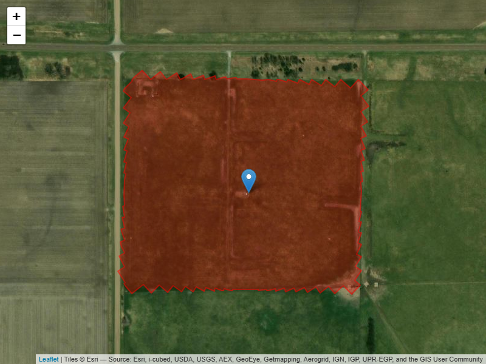

UNL LTAR-PRHPA Eddy Covariance Flux Data Workflow
================
Xiangmin (Sam) Sun
2026-08-11

- [0.1 Overview](#01-overview)
- [0.2 Prerequisites](#02-prerequisites)
- [0.3 Custimizing the workflow](#03-custimizing-the-workflow)
- [0.4 The workflow](#04-the-workflow)
- [1 Site setup](#1-site-setup)
- [2 Quality Assurance and Quality
  Control](#2-quality-assurance-and-quality-control)
  - [2.1 ROI boundary](#21-roi-boundary)
  - [2.2 Naming strategy with the EC
    workflow](#22-naming-strategy-with-the-ec-workflow)
    - [2.2.1 EddyPro full output variable names
      (simplified)](#221-eddypro-full-output-variable-names-simplified)
    - [2.2.2 Meteorological variables](#222-meteorological-variables)
    - [2.2.3 Naming strategy for column
      names:](#223-naming-strategy-for-column-names)
    - [2.2.4 Manual QC guide](#224-manual-qc-guide)
- [3 Gap filling](#3-gap-filling)
  - [3.1 Biological-meteorological variables
    preparation](#31-biological-meteorological-variables-preparation)
- [4 NEE partitioning](#4-nee-partitioning)
- [5 Summary](#5-summary)

<!--
# Eddy Covariance Flux Data processing Protocol at LTAR PRHPA
-->

## 0.1 Overview

This eddy covariance (EC) flux data workflow demonstrates a streamlined
data processing protocol for net ecosystem exchange of CO2
(NEE) and H2O (or evapotranspiration) flux from the [LTAR
platte river/high plains aquifer
(PRHPA)](https://ltar.ars.usda.gov/sites/prhpa/) site. The workflow is
developed mainly based on two R packages, including
[openeddy](https://github.com/lsigut/openeddy) and
[REddyProc](https://github.com/EarthyScience/REddyProc). This
workflow/protocol consists of a set of post-processing functions/steps
for flux data quality control and quality assurance (QAQC).

some abbreviations commonly used in this document and across flux
community:

- EC: Eddy Covariance
- QC: Quality Control
- QA: Quality Assurance
- SA: Sonic Anemometer
- (IR)GA: (Infra-red) Gas Analyzer
- Tau: Momentum Flux ($Kg~m^{-1}~s^{-2}$)
- H: Sensible heat flux ($W~m^{-2}$)
- LE: Latent heat flux ($W~m^{-2}$)
- NEE: Net ecosystem exchange ($\mu mol~m^{-2}~s{-1}$)
- u: Longitudinal wind speed component ($m~s^{-1}$)
- v: Across wind speed component ($m~s^{-1}$)
- w: Vertical wind speed component ($m~s^{-1}$)
- ts: Sonic temperature ($^\circ C$)
- h2o: water vapor ($H_2O$) concentration ($mmol~mol^{-1}$)
- co2: $CO_2$ concentration ($\mu mol~mol^{-1}$)

## 0.2 Prerequisites

This post-processing workflow requires the following inputs:

- [EddyPro](https://www.licor.com/products/eddy-covariance/eddypro) full
  [output
  files](https://www.licor.com/support/EddyPro/topics/output-files-full-output.html).
  Annual complete file for each individual year would be preferred and
  recommended, mostly due to the constraints by gap filling and flux
  partitioning functions in `REddyProc` package. Namely, data series
  with multiple years or fragments shorter than half a year are not well
  supported.

- Meteorological data (or biomet data), went through its independent
  workflow for unit conversion, QAQC, and gap-filling.

The recommended meteorological variables include:

| Label      | Name                                | Unit                    |
|:-----------|:------------------------------------|:------------------------|
| $GR$       | global radiation                    | $W~m^{-2}$              |
| $T_{air}$  | air temperature at EC height        | $^\circ$C               |
| PAR        | photosynthetically active radiation | $\mu mol~m^{-2}~s^{-1}$ |
| $R_n$      | net radiation                       | $W~m^{-2}$              |
| $T_{soil}$ | soil temperature at soil surface    | $^\circ$C               |
| $VPD$      | vapor pressure deficit at EC height | $hPa$                   |
| $RH$       | relative humidity at EC height      | $\%$                    |
| $P$        | precipitation                       | $mm$                    |

Table 1. Recommended meteorological variables for gap-filling.

> **Note:** $GR$ and $T_{air}$ are required for minimum setup. Gaps in
> $GR$ are not allowed due to its use for day/night separation with
> `despikeLF()`.

Packages and software needed to be installed:

- Software and platform: R and R studio
- R packages, including `tidyverse`, `openeddy`, and `REddyProc`
- `fs` package: provides a cross-platform, uniform interface for file
  system operations in R.

## 0.3 Custimizing the workflow

To revise and customize the code for your sites, you mainly need to edit
the `ltar_unl_settings_2026-02-18.R` file accordingly.

The setting edits include: (1) renaming meteorological variables to
workflow standard (`Met_mapping` object) and (2) defining region of
interest (ROI) `boundary`.

## 0.4 The workflow

<figure>

<figcaption aria-hidden="true">The processing chain.</figcaption>
</figure>

# 1 Site setup

Consisting of LTAR-PRHPA Flux site:

- sonic anemometer: CSAT3A, Campbell
- open-path CO2/H2O IRGA:EC150 from Campbell before March 2020, and
  LI-7500DS afterwards
- Data synchronization and data logger: EC 100 and CR5000, Campbell
- Soil heat flux plate, HFP01, 6 cm in depth
- soil water sensor: CS616, 6 cm and 25 cm in depth

# 2 Quality Assurance and Quality Control

Quality assurance (QA) and quality control (QC) are distinct for quality
management of EC flux data. As proactive measure and process-oriented,
QA is to prevent data loss or bad data by establishing routine
maintenance procedures. For example, we need to routinely (remote and in
situ) check the site, inspect and calibrate instruments (especially gas
analyzers), and repair the faulty ones in time. Thoughtful and well
maintenance of the site are critical, such as cleaning the dust,
preventive procedure for damages by weather and animals, and timely
replacing batteries and desiccant bags. An example for best practices
checklist is available from
[Ameriflux.](https://ameriflux.lbl.gov/wp-content/uploads/2023/08/Best_practices_checklist-2023-08-11.pdf)
On the other hand, QC is reactive and product (flux data)-oriented,
namely focusing on detecting and correcting defects in the flux data
through testing and inspection, such as flagging.

QC procedure for EC flux data consist of two phrases:

1.  obtaining QC flags from EddyPro output. The common flagging scheme
    is:

    - flag 0 – high quality
    - flag 1 – minor issues
    - flag 2 – major issues

2.  application of QC filtering (either removing or propagating
    according to the QC flags). Selection of best efficient flags are
    site-dependent and task-specific, considering trade-off between
    deleting spurious data and minimizing gaps and keeping high data
    availability. The common practice is to keep flag 0 and flag 1 data,
    and to discard flag 2 (low data quality) ones.

## 2.1 ROI boundary

The boundary of the study site delineates spatial extent of the studied
ecosystem, or the region of interest (ROI). The edge of the studied
ecosystem is critical for footprint analysis, namely to inspect whether
the ROI is within or beyond the flux fetch (footprint) along the wind
direction.

## 2.2 Naming strategy with the EC workflow

### 2.2.1 [EddyPro full output variable names (simplified)](https://www.licor.com/support/EddyPro/topics/output-files-full-output.html)

| Label | Units | Description |
|:---|:---|:---|
| filename |  | Name of the raw file (or the first of a set) |
| date | yyyy-mm-dd | Date of the end of the averaging period |
| time | HH:MM | Time of the end of the averaging period |
| file_records |  | Number of valid records in raw file(s) |
| used_records |  | Number of valid records |
| Tau | $kg~m^{-1}~s^{-2}$ | Corrected momentum flux |
| qc_Tau |  | Quality flag for momentum flux |
| rand_err_Tau | $kg~m^{-1}~s^{-2}$ | Random error for momentum flux, if selected |
| H | $W~m^{-2}$ | Corrected sensible heat flux |
| qc_H |  | Quality flag for sensible heat |
| rand_err_H | $W~m^{-2}$ | Random error for sensible heat, if selected |
| LE | $W~m^{-2}$ | Corrected latent heat flux |
| qc_LE |  | Quality flag latent heat |
| rand_err_LE | $W~m^{-2}$ | Random error for latent heat, if selected |
| gas_flux | $µmol~m^{-2}~s^{-1}$ (†) | Corrected gas flux |
| qc_gas_flux |  | Quality flag for gas flux |
| rand_err_gas_flux | $µmol~m^{-2}~s^{-1}$ (†) | Random error for gas flux |
| H_strg | $W~m^{-2}$ | Storage sensible heat flux |
| LE_strg | $W~m^{-2}$ | Storage latent heat flux |
| gas_strg | $µmol~m^{-2}~s^{-1}$ (†) | Storage gas flux |
| gas_v-adv | $µmol~m^{-2}~s^{-1}$ (†) | Vertical advection flux |
| gas_molar_density | $mmol~m^{-3}$ | Gas molar density |
| gas_mole_fraction | $µmol~m^{-2}~s^{-1}$ (†) | Gas mole fraction |
| gas_mixing_ratio | $µmol~m^{-2}~s^{-1}$ (†) | Gas mixing ratio |
| air_temperature | K | Mean temperature of ambient air |
| air_pressure | Pa | Air pressure |
| air_density | $kg~m^{-3}$ | Air density |
| air_heat_capacity | $J~K^{-1}~kg^{-1}$ | Specific heat capacity |
| air_molar_volume | $m^3~mol^{-1}$ | Molar volume |
| ET | $mm~hour^{-1}$ | Evapotranspiration |
| RH | % | Relative humidity |
| VPD | Pa | Vapor pressure deficit |
| Tdew | K | Dew point temperature |
| u_rot | $m~s^{-1}$ | Rotated wind u (mean wind speed) |
| v_rot | $m~s^{-1}$ | Rotated wind v (should be 0) |
| w_rot | $m~s^{-1}$ | Rotated wind w (should be 0) |
| wind_speed | $m~s^{-1}$ | Mean wind speed |
| wind_dir | ° | Wind direction (from) |
| u_star | $m~s^{-1}$ | Friction velocity |
| TKE | $m^2~s^{-2}$ | Turbulent kinetic energy |
| L | $m$ | Monin-Obukhov length |
| *zeta* |  | Stability parameter, (z-d)/L |
| bowen_ratio |  | Bowen ratio (H/LE) |
| T_star | K | Scaling temperature |
| footprint_model |  | Footprint model |
| x_offset | $m$ | Footprint offset |
| x_peak | $m$ | Footprint peak |
| x_70% | $m$ | Footprint 70% |
| x_90% | $m$ | Footprint 90% |
| Tau_scf |  | Spectral correction factor for $~Tau$ |
| H_scf |  | Spectral correction factor for $~H$ |
| LE_scf |  | Spectral correction factor for $~LE$ |
| var_spikes |  | Spike numbers detected and eliminated |
| AGC |  | AGC value |
| RSSI |  | RSSI value |
| var_var | (‡) | Variance |
| w_var_cov | (‡) | Covariance |
| extravar_mean | (‡) | Extra variable mean |

Table 2. Shorthand for variables in output files from EddyPro

> † Concentrations and fluxes for water vapor are provided as
> $mmol~mol^{-1}$ and $mmol~m^{-2}~s~^{-1}$, respectively. ‡ Units
> depend on the nature of the variable.

### 2.2.2 Meteorological variables

The variables are listed in the Prerequisites section, in Table 1.

### 2.2.3 Naming strategy for column names:

#### 2.2.3.1 QC prefixes specify which flux is affected:

- qc_Tau\_, qc_H, qc_LE, qc_NEE: only applicable for the respective
  fluxes.
- qc_SA\_: applicable to fluxes replying only on sonic anemometer-SA
  (Tau & H).
- qc_GA\_: applicable to fluxes relying on gas analyzer-GA (LE & NEE),
  where only GA issues are considered.
- qc_SAGA\_:applicable to fluxes relying on both SA and GA (LE & NEE),
  where both SA and GA issues are considered.
- qc_ALL\_:applicable to all fluxes (often not applied to Tau)

#### 2.2.3.2 QC suffixes specify which [QC test/filter](https://www.licor.com/support/EddyPro/topics/despiking-raw-statistical-screening.html) was applied to get the QC flags:

- \_SSITC: steady state and integral turbulence characteristics. A
  typical QC output from EddyPro. Renamed from original qc_Tau, qc_H,
  qc_LE, and qc_co2_flux via `correct()` in `WF_1_data_preparation`.
- \_spikesHF for **despiking**: detecting and eliminating short-term
  outranged values.
- \_ampres for **amplitude**: amplitude resolution of the recorded data
  to capture the flucuation, and to detect the “step ladder appearance”
  in the time series.
- \_dropout for **drop-outs**: identifying short periods of “flat
  valley” in the data series, a sign of short-term instrument
  malfunction. Extreme bins should have less consecutive data points.
- \_abslim for **absolute limits**: values outside a user-defined
  plausible range, such as water concentration above 0.  
- \_skewkurt_sf, \_skewkurt_hf, and \_skewkurt for **skewness and
  Kurtosis**: detect periods of instrument malfunction. Skewness
  measures the asymmetry of probability distribution, while kurtosis
  measures the deviation from normal distribution (peaked or flat).
- \_discont_sf, \_discont_hf, and \_discont for **discontinuities**:
  detect discontinuities that lead to semi-permanent changes.
- \_timelag_sf, \_timelag_hf, and \_timelag for **time Lags** : time
  lags determined by covariance maximization are too different from
  “user-suggested time lags”. Namely, the fluxes miatched for exppected
  time lags and “actual” time lags.
- \_attangle for **angle of attack**: calculate sample-wise angle of
  attacks.
- \_nonsteady for **steadiness of horizontal wind**: test whether
  along-wind and crosswind components undergo a systematic change
  (increase or decrease) throughout the file. Flags the instationary
  horizontal wind.
- \_missfrac: missing data in averaging period
- \_scf: spectral correction factor
- \_wresid: mean unrotated w (double rotation) or w residual (planar
  fit)
- \_runs: runs with repeating values.
- \_lowcov: fluxes too close to 0 (issues during covariance computation)
- \_var: variances
- \_LI7200: CO2 and H2O signal strength
- \_interdep: flux interdependency
- \_man: manual quality control
- \_spikesLF: outliers in low frequency data
- \_fetch70: check of x_70 against fetch distance for give wind
  direction
- \_forGF:composite QC column to screen fluxesfor gap-filling

More details are available via `extract_QC()`.

#### 2.2.3.3 Naming strategy for `REddyProc`

Details are available at the [REddyProcWeb
website](https://bgc.iwww.mpg.de/5624884/Data-Formats)

The input format is:

| Year | DoY | Hour | NEE (umol m-2 s-1) | LE (W m-2) | H (W m-2) | Rg (W m-2) | Tair (°C) | Tsoil (°C) | rH (%) | VPD (hPa) | Ustar (m s-1) |
|:--:|:--:|:--:|:--:|:---|:--:|:---|:--:|:--:|:---|:--:|:--:|
| 1998 | 1 | 0.5 | -1.21 | 1.49 | -11.77 | 0 | 7.4 | 4.19 | 55.27 | 4.6 | 0.72 |
| 1998 | 1 | 1.0 | 1.72 | 3.80 | -13.50 | 0 | 7.5 | 4.20 | 55.95 | 4.6 | 0.52 |
| 1998 | 1 | 1.5 | -9999.00 | 1.52 | -18.30 | 0 | 7.1 | 4.22 | 57.75 | 4.3 | 0.22 |
| 1998 | 1 | 2.0 | -9999.00 | 3.94 | -17.47 | 0 | 6.6 | 4.23 | 60.20 | 3.9 | 0.20 |

Table 3. Eddy covariance flux measurements at half-hourly resolution.

The format is critical. Requirements are:

- Tab-delimited or space-delimited ASCII file (Excel, save as TAB
  delimited text)
- The first row contains variable names, including `Year` (xxxx), `DoY`
  (day of the year, from 1 to 365 or 366), and `Hour` (from 0.5 to 24.0)
  in local time **without** daylight savings time. Flux measurement
  variables are `NEE` (net ecosystem exchange), `LE` (latent heat), and
  `H` (Sensible heat). Meteorological variables are `Rg`(shortwave
  incoming flobal radiation), `VPD`(vapor pressure deficit), `rH`
  (relative humidity), `Tair`(air temperature), `Tsoil` (soil
  temperature), and `Ustar` (friction velocity).
- The second row contains the unit, such as `umolm-2s-1` or `ms-1`, and
  use `-` for filler if not applicable.
- Optional user-specified `season` column: Seasons represent similar
  micro-meteorological conditions, especially surface roughness under
  management in agriculture landscape. The season season for farmland is
  recommened for `u*` filtering. But for grazing pasture, it is not
  critical.
- Three months of data records is minimal requirement.
- `Hour` indicates the **end** of each half-hour period. 48 rows must
  required for each day, and first must be 0.5, and last must be 24.0.
- Low quality or invalid values should not be used, should be set to
  `-9999` beforehand.
- `VPD` is used for gap-filling, and if unavailable, can be calculated
  from `rH` and `Tair`.

The output format are listed as below.

| Suffix | Description |
|:---|:---|
| \_Thres | Threshold of uStar values used to mark insufficient conditions |
| \_orig | Original values used for gap filling |
| \_f | Original values and gaps filled with mean of selected datapoints (condition depending on gap filling method) |
| \_fqc | Quality flag: 0 = original, 1 = most reliable, 2 = medium, 3 = least reliable |
| \_fall | All values considered as gaps (for uncertainty estimates) |
| \_fall_qc | All values considered as gaps (for uncertainty estimates) |
| \_fnum | Number of datapoints used for gap filling |
| \_fsd | Standard deviation of datapoints used for gap filling (uncertainty) |
| \_fsdu | Standard deviation across uStar thresholds (uncertainty, bias) |
| \_fsdug | Combination of random uncertainty and uncertainty due to u\*: sqrt(fsd$^2$ + fsdu$^2$) |
| \_fmeth | Method used for gap filling: 1 = similar meteo condition (sFillLUT with Rg, VPD, Tair); 2 = similar meteo (sFillLUT with Rg only); 3 = mean diurnal course (sFillMDC) |
| \_fwin | Full window length used for gap filling |

Table 4. Description of gap filling output variables.

When bootstrapping was performed, several output columns are
re-estimated with gap-Filling based on low, median, and high estimates
of the uStar-Threshold.

| Suffix | Description |
|:---|:---|
| \_uStar | Estimate on the original unbootstrapped data |
| \_U05 | Low estimate (5% quantile of the bootstrapped uncertainty distribution) |
| \_U50 | Median estimate (50% quantile of the bootstrapped uncertainty distribution) |
| \_U95 | High estimate (95% quantile of the bootstrapped uncertainty distribution) |

Table 5. Bootstrapping the uStar-Threshold estimate

> **Note:** A missing `_uStar` suffix in NEE, GPP, or Reco corresponds
> either to not performing uStar filtering or to the uStar threshold of
> the non-bootstrapped data.

| Variable name | Unit | Description |
|:---|:---|:---|
| GPP_f | $µmol~m^{-2}~s^{-1}$ | Gross primary production, i.e. influx to the land surface (nighttime-based) |
| Reco_f | $µmol~m^{-2}~s^{-1}$ | Ecosystem respiration, i.e. outflux from the land surface (nighttime-based) |
| GPP_DT | $µmol~m^{-2}~s^{-1}$ | Gross primary production by day-time partitioning |
| Reco_DT | $µmol~m^{-2}~s^{-1}$ | Ecosystem respiration by day-time partitioning |
| E0 |  | Activation energy parameter (K) in relationship between temperature and nighttime NEE from night-time partitioning |
| R_ref | $µmol~m^{-2}~s^{-1}$ | Respiration at reference temperature parameter in relationship between temperature and nighttime NEE from night-time partitioning |
| FP_alpha | $µmol~m^{-2}~s^{-1}$ | Canopy light utilization efficiency; represents the initial slope of the light-response curve (daytime partitioning) |
| FP_beta |  | Maximum $CO_2$ uptake rate of the canopy at light saturation (daytime partitioning) |
| FP_k |  | Parameter controlling the VPD limitation of GPP (daytime partitioning) |
| FP_qc |  | Quality flag of the estimated parameters: 0 = good parameter fit; 1 = some parameters out of range, required refit; 2 = next parameter estimate is more than two weeks away (daytime partitioning). |
| FP_dRecPar |  | Records until or after closest record that has a parameter estimate associated (daytime partitioning) |
| FP_GPP2000 |  | GPP at incoming radiation of 2000 $W~m^2$; more robust alternative to saturation FP_k |
| FP_E0 |  | Activation energy parameter (K) in relationship between temperature and nighttime NEE from day-time partitioning |
| FP_RRef | $µmol~m^{-2}~s^{-1}$ | Respiration at reference temperature parameter in relationship between temperature and nighttime NEE from day-time partitioning |
| FP_RRef_Night | $µmol~m^{-2}~s^{-1}$ | Same as FP_RRef using the same FP_E0, but from intermediate step based on night-time data |
| FP\_<X>\_sd |  | Estimated standard deviation of X |
| FP_qc |  | Quality flag of day-time partitioning: 0 = good parameter fit; 1 = LRC parameters were out of range, required refit; 2 = next parameter estimate is more than two weeks away. |

Table 6. Description of flux partitioning output variables

### 2.2.4 Manual QC guide

To minimize bias, manual QC check via `check_manually()` should only
consider precipitation events, strong advection, and unexpected
technical issues, as well as these data neighboring outlying values or
points.

# 3 Gap filling

## 3.1 Biological-meteorological variables preparation

# 4 NEE partitioning

# 5 Summary
